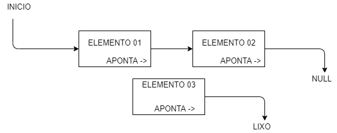
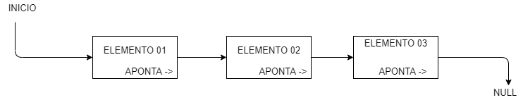
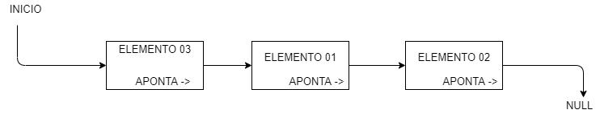

# Resumo sobre alocação de memória/listas/pilhas

### Memória

&nbsp &nbsp &nbsp Inicialmente não podemos esquecer do include <strong><stdlib.h></strong> que será responsável pelas funções <strong>malloc()</strong> e <strong>free()</strong>. Na alocação estática de memória o compilador aloca de maneira automática a memória para uso, sendo assim a tendência do programa é reservar mais memória do que realmente precisa e desperdiçando.  Já na alocação dinâmica podemos alocar memória durante a execução de um programa, a alocação é feita durante a execução. Abrindo assim a possibilidade de alocar memória somente quando necessário e podendo ter controle também da quantidade que vai ser alocada, sendo assim mais memória que o convencional ou até menos.
 
&nbsp &nbsp &nbsp A função <strong>“sizeof”</strong> determina o número de bytes para um determinado tipo de dados. Já a função <strong>“malloc”</strong> ela aloca espaço de memória e retorna um ponteiro do tipo void para o início do espaço de memória alocado. E por fim a função <strong>“free”</strong> que tem sua função de liberar a memória alocada.

### Listas

&nbsp &nbsp &nbsp As listas encadeadas é um tipo de estrutura que contém nela um grupo de nós interligados através de ponteiros, onde nessa estrutura o início aponta para a o primeiro ponteiro e o segundo aponta para o próximo e assim até que o próximo ponteiro a ser apontado seja <strong>NULL</strong> denominando assim o fim da lista. Nas listas utilizamos o <strong>“malloc”</strong> para alocar um espaço na memória onde nossa lista irá ficar, e assim iremos poder atualizar a lista com os valores da posição de cada elemento.
 
&nbsp &nbsp &nbsp Para listas encadeadas temos diversas interações, umas delas adicionar um elemento ao fim da lista, para isso temos que fazer com que nosso último elemento, cujo aquele que aponta para <strong>NULL</strong> aponte para nosso novo elemento e nosso novo elemento aponta para <strong>NULL</strong>, vemos um exemplo com, um início, 2 elementos e um elemento a ser adicionado e <strong>NULL</strong>:

&nbsp &nbsp &nbsp Assim podemos visualizar como seria feita uma adição de um elemento ao final de uma lista, mas caso a fosse uma <strong> adição ao começo da lista </strong> iríamos fazer com que o Início aponte para o novo elemento e o novo elemento aponte para o elemento 01 já na lista, veja o exemplo:

