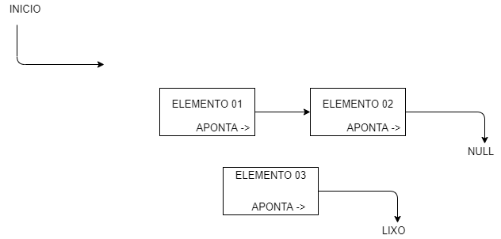
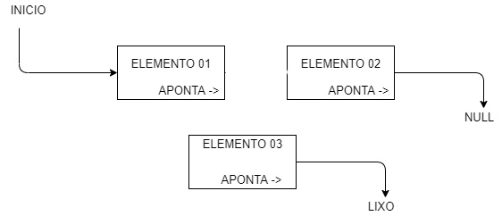
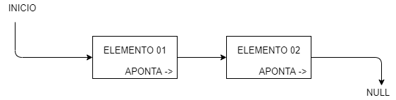
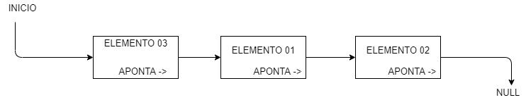
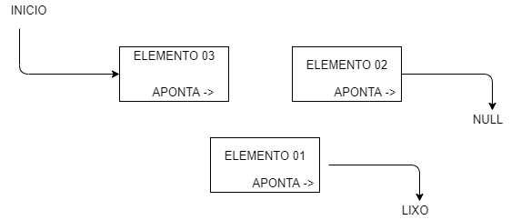
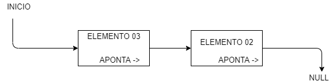

# Resumo sobre alocação de memória/listas/pilhas

### Memória

&nbsp &nbsp &nbsp Inicialmente não podemos esquecer do include <strong><stdlib.h></strong> que será responsável pelas funções <strong>malloc()</strong> e <strong>free()</strong>. Na alocação estática de memória o compilador aloca de maneira automática a memória para uso, sendo assim a tendência do programa é reservar mais memória do que realmente precisa e desperdiçando.  Já na alocação dinâmica podemos alocar memória durante a execução de um programa, a alocação é feita durante a execução. Abrindo assim a possibilidade de alocar memória somente quando necessário e podendo ter controle também da quantidade que vai ser alocada, sendo assim mais memória que o convencional ou até menos.
 
&nbsp &nbsp &nbsp A função <strong>“sizeof”</strong> determina o número de bytes para um determinado tipo de dados. Já a função <strong>“malloc”</strong> ela aloca espaço de memória e retorna um ponteiro do tipo void para o início do espaço de memória alocado. E por fim a função <strong>“free”</strong> que tem sua função de liberar a memória alocada.

### Listas

&nbsp &nbsp &nbsp As listas encadeadas é um tipo de estrutura que contém nela um grupo de nós interligados através de ponteiros, onde nessa estrutura o início aponta para a o primeiro ponteiro e o segundo aponta para o próximo e assim até que o próximo ponteiro a ser apontado seja <strong>NULL</strong> denominando assim o fim da lista. Nas listas utilizamos o <strong>“malloc”</strong> para alocar um espaço na memória onde nossa lista irá ficar, e assim iremos poder atualizar a lista com os valores da posição de cada elemento.
 
&nbsp &nbsp &nbsp Para listas encadeadas temos diversas interações, umas delas adicionar um elemento ao fim da lista, para isso temos que fazer com que nosso último elemento, cujo aquele que aponta para <strong>NULL</strong> aponte para nosso novo elemento e nosso novo elemento aponta para <strong>NULL</strong>, vemos um exemplo com, um início, 2 elementos e um elemento a ser adicionado e <strong>NULL</strong>:

&nbsp &nbsp &nbsp Assim podemos visualizar como seria feita uma adição de um elemento ao final de uma lista, mas caso a fosse uma <strong> adição ao começo da lista </strong> iríamos fazer com que o Início aponte para o novo elemento e o novo elemento aponte para o elemento 01 já na lista, veja o exemplo:

&nbsp &nbsp &nbsp Assim podemos adicionar um elemento ao início da lista, fazendo com que o nosso elemento novo aponte para o antigo primeiro elemento, e claro, o início aponte para o novo elemento. Mas caso a necessidade seja <strong> excluir um elemento da lista </strong>, devemos fazer com que o elemento desejado a ser excluído primeiramente não aponte para nada, no meu exemplo seria o “Lixo”, neste exemplo irei excluir o primeiro elemento, vou usar o do exemplo anterior, com o elemento 03 como primeiro:

&nbsp &nbsp &nbsp Primeiramente devemos remover o elemento desejado de nossa lista, como dito nesse caso o primeiro elemento, com nome de <strong>“Elemento 03”</strong>, após isso nossa lista está sem o <strong>Elemento 03</strong>, mas ainda não podemos dar um <strong>Free ()</strong>, pois ainda ele não definimos onde está nosso início, devemos então fazer com que nosso início aponte para o novo elemento a ser denominado como primeiro, neste caso irá ser o <strong>“Elemento 01”</strong>, agora temos nossa lista completa e fechada novamente, mas ainda temos sobrando na memória o <strong>Elemento 03</strong> que foi removido, para excluir ele e liberar essa memória devemos utilizar o <strong>free()</strong>. Caso a necessidade seja excluir um elemento no meio da lista o procedimento é muito parecido, vamos usar como exemplo a lista com os 03 elementos, vamos dizer que eu queria <strong>remover o elemento</strong> cujo o nome seja <strong>“Elemento 01”</strong> que está no <strong>meio da lista</strong>, eu preciso fazer com que o anterior desse elemento aponte para o seu próximo elemento, veja:

&nbsp &nbsp &nbsp Para nesse caso, remover o <strong>elemento 01</strong>, primeiramente retiramos ele da lista, e devemos fazer com que <strong>elemento 03</strong> aponte para <strong>elemento 02</strong>, sendo assim <strong>elemento 03</strong> o anterior do elemento removido e <strong>elemento 02</strong> o sucessor, após isso podemos aplicar o <strong>free()</strong> para por fim excluir o <strong>elemento 01</strong> e liberar a memória.

### Pilhas

&nbsp &nbsp &nbsp A pilha nada mais é que uma forma de organizar e usar dados,e para podermos imaginar melhor como funciona podemos imaginar uma pilha de pratos, onde o ultimo prato a ser adicionado a pilha sera o primeiro, no caso ele esta sempre no topo, e para essa regra damos a definicao do LIFO - Last In, First Out, ou seja, o último a entrar é o primeiro a sair da estrutura.
 
<strong> &nbsp &nbsp &nbsp  "Os últimos serão primeiros, e os primeiros serão últimos" - Mateus 20</strong>

